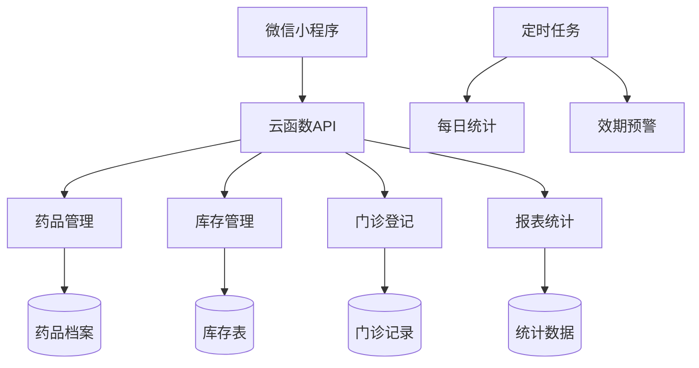
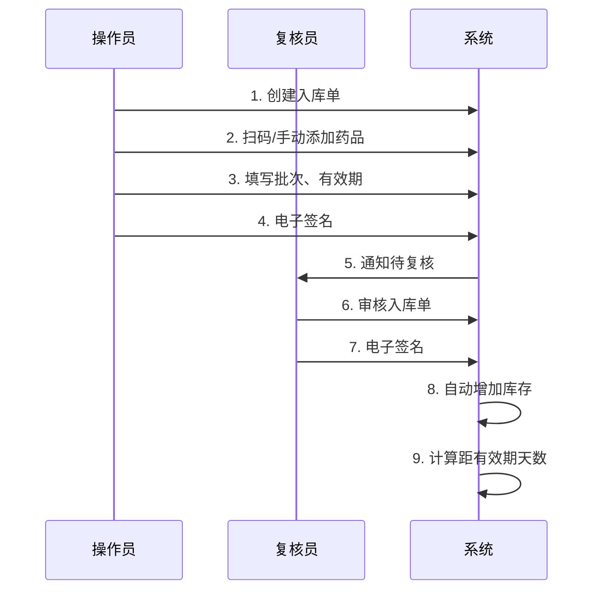
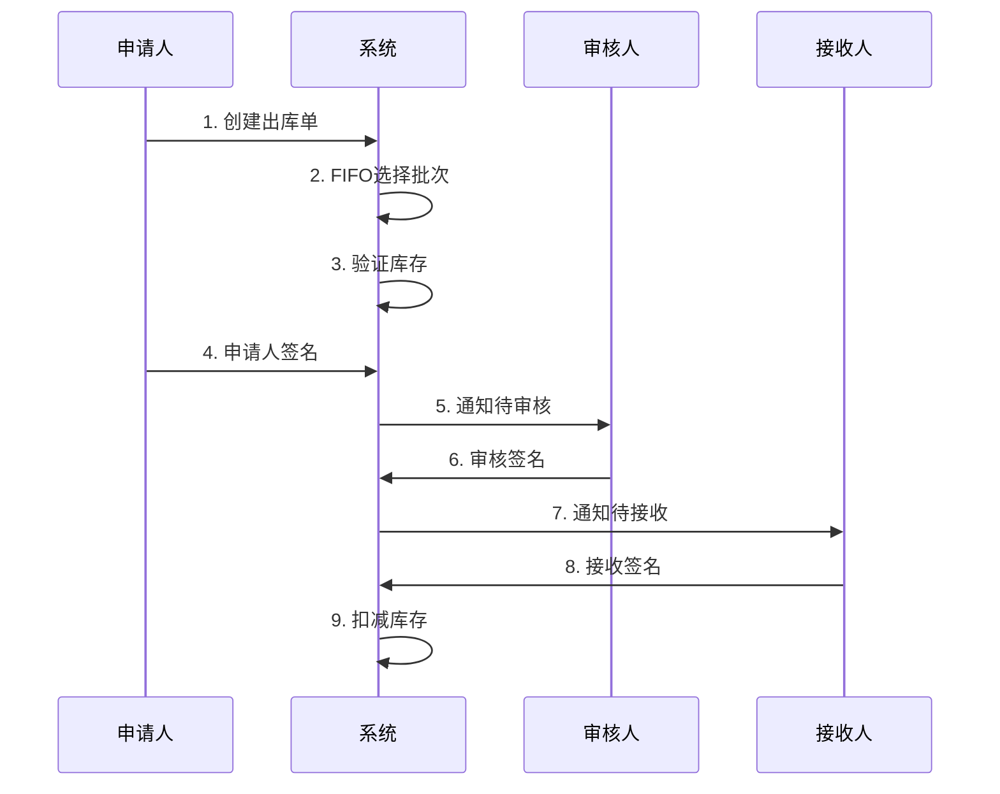
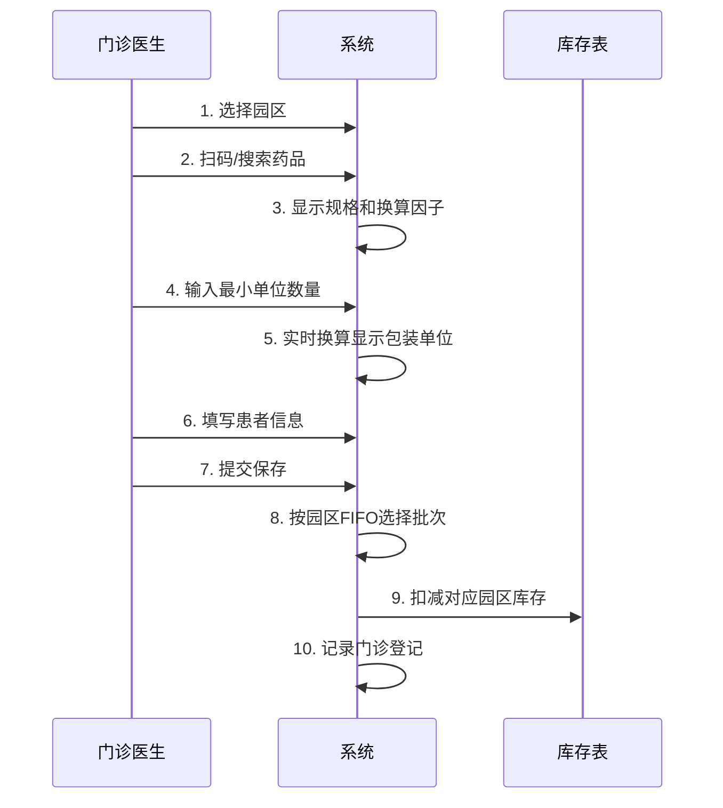
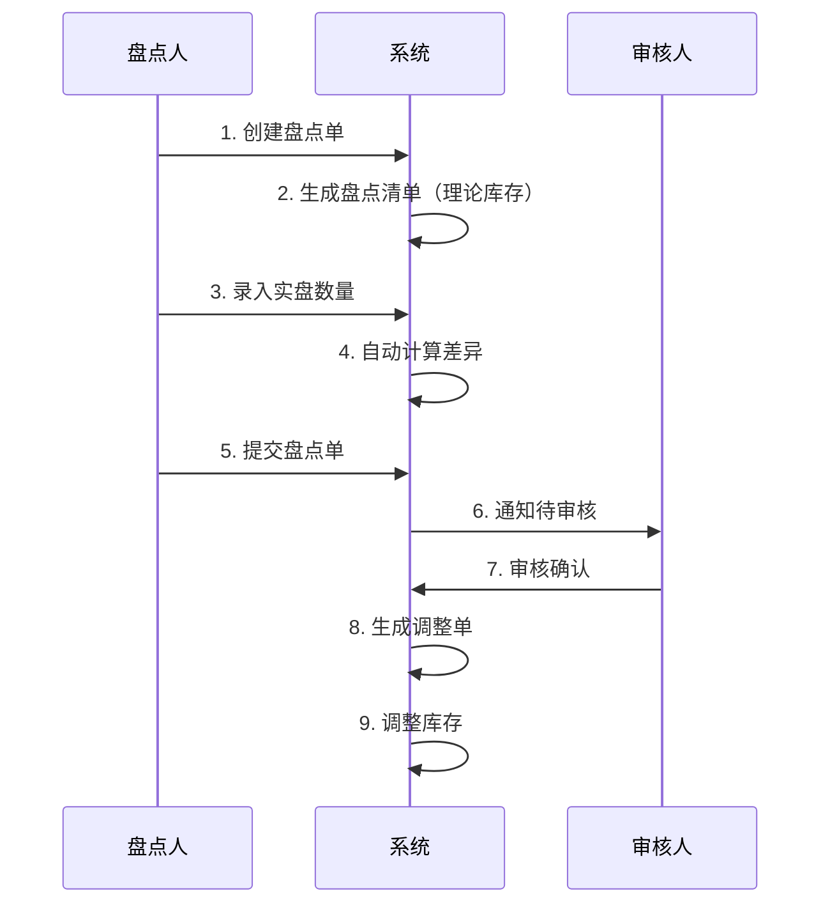
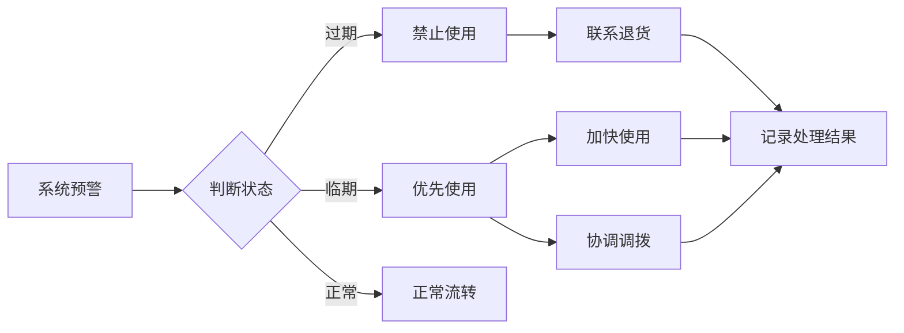

# 📘 AK-PMS 药材管理系统 v3.3 功能与管理文档

<div align="center">

**Version 3.3 — Final Deliverable Edition**  
**开发平台**: 微信小程序 + 腾讯云开发  
**完成日期**: 2025-11-01  
**维护团队**: AK-PMS Dev Team  
**服务单位**: 北京欢乐谷医务室

---

**面向对象**: 系统管理员、医务人员、使用者  
**文档版本**: v3.3  
**最后更新**: 2025-11-01

</div>

---

## 📑 文档目录

- [1. 系统概述](#1-系统概述)
- [2. 角色与权限](#2-角色与权限)
- [3. 核心功能模块](#3-核心功能模块)
  - [3.1 药品档案管理](#31-药品档案管理)
  - [3.2 入库管理](#32-入库管理)
  - [3.3 出库管理](#33-出库管理)
  - [3.4 门诊用药登记](#34-门诊用药登记-🔥-v32核心功能)
  - [3.5 库存管理](#35-库存管理)
  - [3.6 日常消耗统计](#36-日常消耗统计)
  - [3.7 请领管理](#37-请领管理)
  - [3.8 盘点管理](#38-盘点管理)
- [4. 报表与查询功能](#4-报表与查询功能-🔥-v33新增)
  - [4.1 五大核心报表](#41-五大核心报表)
  - [4.2 六项常用查询](#42-六项常用查询)
- [5. 有效期预警系统](#5-有效期预警系统-🔥-v33核心)
- [6. 使用指南](#6-使用指南)
- [7. 常见问题FAQ](#7-常见问题faq)
- [8. 系统配置与管理](#8-系统配置与管理)

---

## 1. 系统概述

### 1.1 系统简介

AK-PMS（AiKang Pharmacy Management System）是专为北京欢乐谷医务室打造的药材智能管理系统，采用微信小程序技术，基于腾讯云开发平台，实现药材的全流程数字化管理。

### 1.2 系统架构



### 1.3 核心业务场景

| 场景 | 描述 | 涉及模块 |
|------|------|---------|
| **采购入库** | 药品验收入库，记录批次和有效期 | 入库管理、药品档案 |
| **园区领用** | 陆园/水园领用药品，FIFO出库 | 出库管理、库存管理 |
| **门诊用药** | 门诊医生登记患者用药，分园区扣库存 | 门诊登记、库存管理 |
| **库存预警** | 低库存、临期/过期自动预警 | 库存管理、预警系统 |
| **数据统计** | 消耗趋势、成本分析、盘点对比 | 报表统计、查询功能 |

### 1.4 系统特色

✅ **分园区管理** - 陆园、水园、医务室仓库独立库存  
✅ **批次级管理** - 精确到批次，支持FIFO先进先出  
✅ **智能单位换算** - 入库/出库按包装单位，门诊按最小单位  
✅ **有效期预警** - 60天临期标准，自动推送提醒  
✅ **双人复核** - 关键操作电子签名，操作可追溯  
✅ **可视化报表** - ECharts图表，数据一目了然  

### 1.5 系统元信息

```yaml
system:
  name: AK-PMS (Aikang Pharmacy Management System)
  version: 3.3
  environments:
    - dev: akpms-dev
    - prod: akpms-prod
  database: cloudbase (MongoDB-like)
  frontend: WeChat Mini Program
  backend: Cloud Functions (Node.js 18)
  last_update: 2025-11-01
```

---

## 2. 角色与权限

### 2.1 角色定义

| 角色 | 英文标识 | 主要职责 |
|------|---------|---------|
| **系统管理员** | admin | 系统配置、用户管理、全局权限 |
| **药剂师** | pharmacist | 药品管理、入库审核、库存管理 |
| **门诊医生** | doctor | 门诊用药登记、查询 |
| **仓库管理员** | clerk | 出库操作、库存查询 |

### 2.2 权限矩阵

| 模块 | 系统管理员 | 药剂师 | 门诊医生 | 仓库管理员 |
|------|-----------|-------|---------|-----------|
| **药品档案** | CRUD | CRU | R | R |
| **入库管理** | CRUD + 审核 | CRUD + 审核 | - | R |
| **出库管理** | CRUD + 审核 | 审核 | - | CR |
| **门诊登记（分园区）** | CRUD | R | CRUD | - |
| **日常消耗** | CRUD | CRUD | R | R |
| **库存管理** | CRUD | CRUD | R | R |
| **请领管理** | 全部权限 | 审批 | 申请 | 申请 |
| **报表统计** | 全部报表 | 全部报表 | 门诊报表 | 出库报表 |
| **查询功能** | 全部查询 | 全部查询 | 门诊查询 | 库存/出库查询 |
| **用户管理** | ✅ | - | - | - |
| **系统配置** | ✅ | - | - | - |

**说明**:
- CRUD = Create(新增) / Read(查看) / Update(修改) / Delete(删除)
- 各园区门诊医生只能登记和查看本园区数据
- 审核操作需要双人签字确认

---

## 3. 核心功能模块

### 3.1 药品档案管理

#### 功能概述
维护药品基础信息，包括规格、单位、换算因子、条形码等，为其他模块提供基础数据。

#### 字段说明

| 字段 | 类型 | 必填 | 说明 | 示例 |
|------|------|------|------|------|
| 药品名称 | String | ✅ | 通用名称 | 阿莫西林胶囊 |
| **规格** 🔥 | String | ✅ | 药品规格 | 0.25g×24粒 |
| 包装单位 | String | ✅ | 入库/出库单位 | 盒 |
| 最小单位 | String | ✅ | 门诊/消耗单位 | 粒 |
| **换算因子** | Number | ✅ | 包装单位含多少最小单位 | 24 |
| 生产厂家 | String | ✅ | 厂家名称 | XX制药有限公司 |
| 条形码 | String | - | 扫码识别 | 6901234567890 |
| 分类 | String | - | 药品分类 | 抗生素/止痛药/急救药 |
| 单价 | Number | ✅ | 采购单价（元） | 15.50 |
| 是否高值药品 | Boolean | - | 贵重药品标记 | true/false |
| 是否急救药品 | Boolean | - | 急救药品标记 | true/false |
| 拼音首字母 | String | 自动 | 快速搜索 | AMXLJN |

#### 单位换算说明 🔥

**核心概念**:
- **包装单位**: 采购、入库、出库时使用（如：盒、瓶、板）
- **最小单位**: 门诊用药、日常消耗时使用（如：粒、片、ml）
- **换算因子**: 1个包装单位 = N个最小单位

**示例**:
```
阿莫西林胶囊
├─ 规格: 0.25g×24粒
├─ 包装单位: 盒
├─ 最小单位: 粒
└─ 换算因子: 24 (1盒 = 24粒)

入库: 100盒
门诊用药: 12粒 = 0.5盒 (自动换算)
库存扣减: -0.5盒
```

#### 操作指南

**1. 新增药品**
```
步骤:
1. 点击"药品档案" → "新增药品"
2. 填写基本信息（带*号为必填）
3. 重点填写"规格"和"换算因子"
4. 扫描或手动输入条形码
5. 保存提交

注意事项:
⚠️ 换算因子必须准确，影响库存计算
⚠️ 条形码不能重复
⚠️ 拼音首字母会自动生成
```

**2. 修改药品**
```
步骤:
1. 搜索找到药品
2. 点击"编辑"
3. 修改信息（药品名称和条形码不建议修改）
4. 保存提交

限制:
⚠️ 有库存的药品，不能修改换算因子
⚠️ 有入库记录的药品，不能删除
```

**3. 扫码查询**
```
操作:
1. 点击"扫一扫"图标
2. 扫描药品条形码
3. 自动显示药品详情
4. 可直接跳转到入库/出库
```

---

### 3.2 入库管理

#### 功能概述
药品采购入库，记录批次信息、生产日期、有效期，审核通过后自动增加库存。

#### 业务流程



#### 核心字段

| 字段 | 必填 | 说明 |
|------|------|------|
| 入库日期 | ✅ | 默认当天 |
| 供应商 | ✅ | 供应商名称 |
| 药品信息 | ✅ | 名称、规格、单位 |
| 批次号 | ✅ | 生产批次 |
| 生产日期 | ✅ | 生产日期 |
| **有效期** 🔥 | ✅ | 药品有效期至 |
| 数量 | ✅ | 包装单位数量 |
| 单价 | ✅ | 采购单价 |
| 金额 | 自动 | 数量×单价 |
| 园区 | ✅ | 入库到哪个园区 |
| 操作员签名 | ✅ | 电子签名 |
| 复核员签名 | ✅ | 审核时签名 |

#### 操作指南

**创建入库单**
```
步骤:
1. 首页 → "入库管理" → "新增入库"
2. 选择供应商
3. 添加药品:
   - 方式1: 扫码添加（推荐）
   - 方式2: 搜索添加
   - 方式3: 从常用药品选择
4. 填写批次信息:
   ⚠️ 批次号: 必填，药盒上查看
   ⚠️ 生产日期: 必填
   ⚠️ 有效期: 必填，决定FIFO顺序
5. 填写数量和单价（包装单位）
6. 选择入库园区
7. 操作员签名
8. 提交等待审核

注意:
- 同一批次号的药品不能重复入库
- 有效期必须大于当前日期
- 数量必须为正整数
```

**审核入库单**
```
步骤（复核员）:
1. 首页 → "待审核"徽章 → "入库待审核"
2. 查看入库单详情
3. 核对:
   ✓ 药品名称、规格是否正确
   ✓ 批次号、有效期是否准确
   ✓ 数量、单价是否符合
4. 选择"通过"或"驳回"
5. 填写审核意见（可选）
6. 复核员签名
7. 提交

审核通过后:
✅ 库存自动增加
✅ 系统计算距有效期天数
✅ 记录操作日志
```

---

### 3.3 出库管理

#### 功能概述
园区领用药品，系统按FIFO原则自动选择批次，审核通过后自动扣减库存。

#### 园区分类

| 园区标识 | 中文名称 | 说明 |
|---------|---------|------|
| `land_park` | 陆园 | 陆地游乐园区 |
| `water_park` | 水园 | 水上游乐园区 |
| `clinic_storage` | 医务室仓库 | 医务室自用 |

#### FIFO批次选择逻辑 🔥

```javascript
// 自动按有效期最早的批次出库
优先级排序:
1. 有效期最早的批次（先进先出）
2. 库存充足的批次
3. 同一园区的批次

示例:
批次A: 有效期 2025-12-31, 库存 50盒
批次B: 有效期 2026-03-31, 库存 100盒
批次C: 有效期 2026-01-15, 库存 30盒

出库优先顺序: 批次A → 批次C → 批次B
```

#### 业务流程



#### 操作指南

**创建出库单**
```
步骤:
1. 首页 → "出库管理" → "新增出库"
2. 选择目标园区（陆园/水园/医务室）
3. 添加药品并填写数量
4. 系统自动:
   - 显示可用库存
   - 按FIFO选择批次
   - 显示有效期预警（如有）
5. 填写用途和备注
6. 申请人签名
7. 提交

预警提示:
🟧 临期药品: 有效期≤60天，橙色提示
🟥 过期药品: 已过有效期，禁止出库
💰 高值药品: 显示金额提示
```

**审核出库单**
```
步骤（审核人）:
1. 查看待审核出库单
2. 核对:
   ✓ 目标园区是否正确
   ✓ 数量是否合理
   ✓ 库存是否充足
   ✓ 是否有临期预警
3. 审核签名
4. 提交

审核通过后:
→ 状态变为"待接收"
→ 通知接收人
```

**接收确认**
```
步骤（接收人）:
1. 查看待接收出库单
2. 实物核对
3. 接收签名
4. 完成

接收确认后:
✅ 库存自动扣减
✅ 记录完整流转链路
✅ 更新统计数据
```

---

### 3.4 门诊用药登记 🔥 v3.2核心功能

#### 功能概述
门诊医生登记患者用药情况，按**最小单位**记录，系统自动换算并扣减对应园区库存。

#### 设计理念 ⭐⭐⭐

```
核心创新点:
1. 分园区登记: 陆园门诊/水园门诊独立登记
2. 最小单位录入: 符合医生用药习惯（如：6粒，不是0.25盒）
3. 自动单位换算: 系统自动换算成包装单位扣库存
4. 实时扣库存: 登记即扣减，保证库存准确性
5. 快速入口: 首页一键进入，提高效率
```

#### 业务流程



#### 核心字段

| 字段 | 必填 | 说明 | 示例 |
|------|------|------|------|
| **园区** 🔥 | ✅ | 陆园/水园/医务室 | land_park |
| 药品信息 | ✅ | 名称、规格 | 阿莫西林胶囊 0.25g×24粒 |
| **最小单位数量** 🔥 | ✅ | 按最小单位输入 | 6粒 |
| **包装单位数量** | 自动 | 系统自动换算 | 0.25盒 |
| 患者姓名 | ✅ | 患者姓名 | 张三 |
| 症状 | - | 症状描述（可选） | 感冒发烧 |
| 登记时间 | 自动 | 系统时间 | 2025-11-01 14:35:42 |
| 操作医生 | 自动 | 当前登录用户 | 李医生 |

#### 单位换算详解 🔥

**示例1: 阿莫西林胶囊**
```
药品信息:
├─ 规格: 0.25g×24粒
├─ 包装单位: 盒
├─ 最小单位: 粒
└─ 换算因子: 24

门诊登记:
├─ 医生输入: 6粒（最小单位）
├─ 系统换算: 6 ÷ 24 = 0.25盒（包装单位）
└─ 库存扣减: -0.25盒
```

**示例2: 布洛芬混悬液**
```
药品信息:
├─ 规格: 100ml/瓶
├─ 包装单位: 瓶
├─ 最小单位: ml
└─ 换算因子: 100

门诊登记:
├─ 医生输入: 15ml（最小单位）
├─ 系统换算: 15 ÷ 100 = 0.15瓶（包装单位）
└─ 库存扣减: -0.15瓶
```

#### 界面设计

```
┌──────────────────────────────────────┐
│  门诊用药登记                          │
├──────────────────────────────────────┤
│                                      │
│  园区选择: ● 陆园  ○ 水园  ○ 医务室   │
│                                      │
│  药品名称: [阿莫西林胶囊        ] [扫码] │
│  规格: 0.25g×24粒                    │
│                                      │
│  用量: [6] 粒 = 0.25 盒 ← 自动换算    │
│                                      │
│  患者: [张三_____________________]   │
│  症状: [感冒发烧_________________]   │
│                                      │
│  当前库存: 32盒 (陆园)                │
│                                      │
│          [取消]      [保存并扣库存]    │
└──────────────────────────────────────┘
```

#### 操作指南

**门诊登记步骤**
```
1. 首页快捷入口 → "门诊用药"
2. 选择园区:
   ⚠️ 陆园门诊 → 选"陆园"
   ⚠️ 水园门诊 → 选"水园"
3. 选择药品:
   - 扫码（推荐）
   - 搜索药品名
4. 输入用量（最小单位）:
   - 系统实时显示换算结果
   - 如: 6粒 = 0.25盒
5. 填写患者信息
6. 点击"保存"

保存后立即:
✅ 扣减对应园区库存
✅ 记录门诊登记
✅ 可立即登记下一位患者
```

**快速连续登记技巧**
```
技巧1: 常用药品收藏
- 点击药品右侧"⭐"收藏
- 下次直接从收藏选择

技巧2: 批量登记
- 勾选"继续登记"
- 保存后自动清空，可立即登记下一位

技巧3: 语音输入
- 患者姓名支持语音输入
- 点击输入框右侧麦克风图标
```

#### 数据记录示例

```json
{
  "_id": "CU20251101001",
  "drugId": "DR001",
  "drugName": "阿莫西林胶囊",
  "specification": "0.25g×24粒",
  "batchId": "BATCH20251101",
  "location": "land_park",
  "quantityMin": 6,
  "quantityPack": 0.25,
  "minUnit": "粒",
  "packUnit": "盒",
  "operatorId": "openid_doctor",
  "operatorName": "李医生",
  "patient": "张三",
  "symptom": "感冒发烧",
  "createTime": "2025-11-01T14:35:42Z"
}
```

---

### 3.5 库存管理

#### 功能概述
实时查看各园区库存情况，支持汇总库存和批次库存查看，提供低库存和临期预警。

#### 查看模式

**模式1: 汇总库存（按药品汇总）**
```
阿莫西林胶囊 0.25g×24粒
├─ 陆园: 32盒
├─ 水园: 45盒
└─ 医务室: 28盒
总计: 105盒  价值: ¥1,627.50
```

**模式2: 批次库存（精确到批次）**
```
阿莫西林胶囊 0.25g×24粒 - 陆园
├─ 批次A: 20231101, 20盒, 2025-12-31 (59天) 🟧临期
├─ 批次B: 20231115, 12盒, 2026-03-15 (134天) 🟩正常
└─ 总计: 32盒
```

#### 库存状态

| 状态 | 图标 | 触发条件 | 说明 |
|------|------|---------|------|
| **正常** | 🟢 | 库存充足，距有效期>60天 | 正常库存 |
| **低库存** | 🟠 | 库存≤最低库存量 | 需要补货 |
| **临期** | 🟧 | 距有效期≤60天 | 优先使用 |
| **过期** | 🟥 | 已过有效期 | 禁止使用 |
| **零库存** | ⚫ | 库存=0 | 紧急补货 |

#### 理论库存计算公式 🔥

```javascript
理论库存(drugId, batch, location) = 
    Σ 入库数量(该药品,该批次,该园区)
  - Σ 出库数量(该药品,该批次,该园区)
  - Σ 门诊用药数量(该药品,该批次,该园区)  // v3.2新增
  + Σ 盘点调整数量(该药品,该批次,该园区)
```

**示例**:
```
阿莫西林胶囊 - 批次A - 陆园
├─ 入库: +100盒 (2025-10-01)
├─ 出库: -30盒 (部门领用)
├─ 门诊: -40盒 (门诊用药)
├─ 调整: +2盒 (盘点调整)
└─ 理论库存: 32盒
```

#### 操作指南

**查看库存**
```
1. 首页 → "库存管理"
2. 选择园区（全部/陆园/水园/医务室）
3. 选择查看模式:
   - 汇总库存: 按药品汇总
   - 批次库存: 显示每个批次详情
4. 支持:
   - 搜索药品名称
   - 筛选状态（低库存/临期/过期）
   - 按有效期排序
```

**预警查看**
```
低库存预警:
→ 首页"预警"卡片 → "低库存"
→ 显示所有低于最低库存量的药品

临期/过期预警:
→ 首页"预警"卡片 → "近效期"
→ 显示所有≤60天到期的药品
→ 过期药品标红色
```

---

### 3.6 日常消耗统计

#### 功能概述
记录日常非门诊的药品消耗（如：办公室常备药、员工福利发放等），按最小单位登记。

#### 与门诊登记的区别

| 对比项 | 门诊用药登记 | 日常消耗统计 |
|-------|-------------|-------------|
| **用途** | 患者门诊用药 | 非门诊消耗（员工福利、办公室常备等） |
| **登记人** | 门诊医生 | 任何有权限的人员 |
| **必填字段** | 患者姓名 | 无需患者信息 |
| **统计维度** | 门诊报表 | 消耗报表 |
| **单位** | 最小单位 | 最小单位 |
| **扣库存** | ✅ 实时扣减 | ✅ 实时扣减 |

#### 应用场景

```
场景1: 办公室常备药
- 员工感冒，从办公室药箱取药
- 登记: 药品、数量、用途"办公室常备"

场景2: 员工福利发放
- 夏季发放防暑药品
- 登记: 药品、数量、用途"员工福利"

场景3: 培训用药
- 急救培训使用的药品
- 登记: 药品、数量、用途"培训使用"
```

---

### 3.7 请领管理

#### 功能概述
部门向医务室申请领用药品，支持申请、审批、发放全流程管理。

#### 业务流程

```
申请人 → 申请 → 待审批
         ↓
       审批人 → 审批通过 → 待发放
                ↓
              发放人 → 发放 → 待接收
                       ↓
                     接收人 → 接收 → 完成（扣库存）
```

#### 状态流转

| 状态 | 说明 | 可操作人 | 下一步 |
|------|------|---------|--------|
| 待审批 | 刚提交申请 | 审批人 | 通过/驳回 |
| 待发放 | 审批通过 | 发放人 | 发放 |
| 待接收 | 已发放 | 接收人 | 接收确认 |
| 已完成 | 已接收 | - | - |
| 已驳回 | 审批驳回 | - | - |

---

### 3.8 盘点管理

#### 功能概述
定期盘点库存，对比理论库存与实际库存，生成盘点差异报表，调整库存。

#### 盘点流程



#### 盘点报表字段 🔥

| 字段 | 说明 | 计算方式 |
|------|------|---------|
| 药品名称 | - | - |
| **规格** 🔥 | 药品规格 | - |
| 批次号 | - | - |
| 园区 | - | - |
| 理论库存 | 系统计算 | 入库-出库-门诊+调整 |
| 实际库存 | 人工盘点 | - |
| 差异量 | 盈亏 | 实际-理论 |
| 差异率 | 百分比 | (实际-理论)/理论×100% |
| **有效期** 🔥 | - | - |
| **距有效期天数** 🔥 | 自动计算 | 有效期-今天 |
| **状态** 🔥 | 正常/临期/过期 | 根据距有效期天数判断 |

#### 盘点差异处理

```
盘盈（实际>理论）:
→ 调查原因（可能是漏记入库）
→ 生成调整单（+差异量）
→ 更新库存

盘亏（实际<理论）:
→ 调查原因（可能是遗失、损耗）
→ 生成调整单（-差异量）
→ 更新库存
→ 记录损耗原因

临期药品处理:
→ 标记临期（≤60天）
→ 优先使用或退货
→ 跟踪处理结果
```

---

## 4. 报表与查询功能 🔥 v3.3新增

### 4.1 五大核心报表

#### R1: 入库明细报表

**用途**: 采购入库记录及有效期状态追踪  
**适用**: 财务核对、补货分析、效期管理

**报表字段**:
| 字段 | 说明 |
|------|------|
| 日期 | 入库日期 |
| 药品名称 | - |
| **规格** 🔥 | 药品规格 |
| 批号 | 生产批次 |
| 厂家 | 生产厂家 |
| 数量 | 入库数量 |
| 单价 | 采购单价 |
| 金额 | 数量×单价 |
| **有效期** 🔥 | 药品有效期至 |
| **距有效期(天)** 🔥 | 自动计算 |
| 操作人 | 操作员姓名 |

**筛选条件**:
- 时间范围
- 供应商
- 药品名称
- 有效期范围

**导出格式**: Excel / PDF

---

#### R2: 出库与请领汇总报表

**用途**: 各园区出库记录与药品流向分析  
**适用**: 药品流向追溯、成本分摊、领用统计

**报表字段**:
| 字段 | 说明 |
|------|------|
| 日期 | 出库日期 |
| 药品名称 | - |
| **规格** 🔥 | 药品规格 |
| 园区 | 陆园/水园/医务室 |
| 数量 | 出库数量 |
| 用途 | 领用用途 |
| **有效期** 🔥 | 批次有效期 |
| **距有效期(天)** 🔥 | 自动计算 |

**图表展示**:
- 📊 园区出库量对比（饼图）
- 📈 出库趋势（折线图）

**筛选条件**:
- 时间范围
- 园区
- 部门
- 药品名称

---

#### R3: 门诊用药统计报表（分园区）🔥

**用途**: 门诊用药消耗趋势分析  
**适用**: 门诊医生、药剂师、管理层

**报表字段**:
| 字段 | 说明 |
|------|------|
| 日期 | 登记日期 |
| 药品名称 | - |
| **规格** 🔥 | 药品规格 |
| 园区 | 陆园门诊/水园门诊 |
| 用量 | 最小单位数量 |
| 操作者 | 登记医生 |

**图表展示**:
- 📈 门诊用药趋势（折线图）
  - X轴: 日期
  - Y轴: 用量
  - 多线: 按园区分组
- 📊 药品用量TOP10（柱状图）
- 🥧 园区用药占比（饼图）

**筛选条件**:
- 时间范围
- 园区
- 药品名称
- 操作医生

**统计维度**:
- 按日统计
- 按药品统计
- 按园区统计
- 按医生统计

---

#### R4: 库存结存与有效期预警报表 ⭐⭐⭐

**用途**: 实时库存监控与有效期预警  
**适用**: 药剂师、仓库管理员、管理层

**报表字段**:
| 字段 | 说明 | 预警规则 |
|------|------|---------|
| 药品名称 | - | - |
| **规格** 🔥 | 药品规格 | - |
| 批号 | 生产批次 | - |
| 园区 | 所在园区 | - |
| 理论库存 | 系统计算 | - |
| 实际库存 | 当前库存 | - |
| 单位 | 包装单位 | - |
| **有效期** 🔥 | 药品有效期至 | - |
| **距有效期(天)** 🔥 | 自动计算 | ≤60天临期，≤0过期 |
| **状态** 🔥 | 预警状态 | 🟥过期 / 🟧临期 / 🟩正常 |

**预警规则** 🔥:
```
过期: 距有效期 ≤ 0天 → 🟥 红色，禁止使用
临期: 距有效期 ≤ 60天 → 🟧 橙色，优先使用
正常: 距有效期 > 60天 → 🟩 绿色
```

**图表展示**:
- 📊 库存预警仪表盘
  - 红区: 过期药品数量
  - 橙区: 临期药品数量
  - 绿区: 正常药品数量
- 📈 有效期分布图
  - X轴: 距有效期天数分段（<0, 0-30, 31-60, 61-90, >90）
  - Y轴: 批次数量

**筛选条件**:
- 园区
- 预警状态（过期/临期/正常）
- 有效期范围

**示例报表**:
```
┌────────────┬──────────┬───────┬─────┬──────┬────┬────────┬──────────┬────┐
│ 药品名称     │ 规格      │ 批号   │ 园区  │ 库存  │ 单位│ 有效期   │ 距期(天) │状态│
├────────────┼──────────┼───────┼─────┼──────┼────┼────────┼──────────┼────┤
│ 阿莫西林胶囊 │ 0.25g×24粒│ B001  │陆园  │  32  │ 盒 │2025-12-30│    59    │🟧临期│
│ 头孢克肟    │ 0.1g×12片 │ B002  │水园  │  15  │ 盒 │2026-03-15│   134    │🟩正常│
│ 氯雷他定    │ 10mg×12片 │ B003  │医务室│  20  │ 盒 │2025-10-30│    -2    │🟥过期│
└────────────┴──────────┴───────┴─────┴──────┴────┴────────┴──────────┴────┘

汇总:
- 总批次: 45个
- 过期: 3个 (🟥)
- 临期: 8个 (🟧)
- 正常: 34个 (🟩)
```

---

#### R5: 盘点差异分析报表

**用途**: 盘点账实核对与临期药品监测  
**适用**: 药剂师、管理员、财务

**报表字段**:
| 字段 | 说明 |
|------|------|
| 药品名称 | - |
| **规格** 🔥 | 药品规格 |
| 批号 | 生产批次 |
| 园区 | 所在园区 |
| 理论库存 | 系统计算 |
| 实际库存 | 人工盘点 |
| 差异量 | 实际-理论 |
| 差异率 | (实际-理论)/理论×100% |
| **有效期** 🔥 | 药品有效期至 |
| **距有效期(天)** 🔥 | 自动计算 |

**图表展示**:
- 📊 盘点差异对比（柱状图）
  - X轴: 药品名称
  - Y轴: 理论库存 vs 实际库存
  - 颜色: 红=盘亏 / 绿=盘盈
- 📈 差异率分布（饼图）

**筛选条件**:
- 盘点月份
- 园区
- 差异类型（盘盈/盘亏/无差异）

---

### 4.2 六项常用查询

#### Q1: 药品综合查询

**条件字段**:
- 药品名称（模糊）
- **规格**（模糊）
- 批号
- 厂家（模糊）
- 园区

**显示字段**:
- 药品基本信息
- **有效期** 🔥
- **距有效期天数** 🔥
- 库存分布（各园区）

---

#### Q2: 实时库存查询 ⭐

**条件字段**:
- 园区
- 药品名称（模糊）
- 批号
- 有效期范围
- 预警状态（过期/临期/正常）

**显示字段**:
- 药品名称、规格
- 批次信息
- 当前库存
- **有效期** 🔥
- **距有效期天数** 🔥
- **预警状态** 🔥（带颜色图标）

---

#### Q3: 门诊用药查询

**条件字段**:
- 日期范围
- 园区
- 药品名称（模糊）
- 操作医生

**显示字段**:
- 日期时间
- 药品名称、**规格** 🔥
- 用量（最小单位）
- 患者姓名
- 操作医生

---

#### Q4: 入库记录查询

**条件字段**:
- 入库日期范围
- 厂家（模糊）
- 药品名称（模糊）
- 操作人

**显示字段**:
- 入库日期
- 药品信息
- 批次、**有效期** 🔥
- 数量、金额
- 操作人

---

#### Q5: 出库记录查询

**条件字段**:
- 出库日期范围
- 园区
- 部门
- 药品名称（模糊）

**显示字段**:
- 出库日期
- 药品信息
- 园区、部门
- 数量
- **有效期** 🔥
- 状态

---

#### Q6: 盘点历史查询

**条件字段**:
- 盘点月份
- 园区
- 药品名称（模糊）

**显示字段**:
- 盘点日期
- 药品信息
- 理论库存、实际库存
- 差异量、差异率
- **有效期** 🔥
- **距有效期天数** 🔥

---

## 5. 有效期预警系统 🔥 v3.3核心

### 5.1 预警规则

#### 判定标准（最终版）⭐

```javascript
function expiryStatus(daysToExpiry) {
  if (daysToExpiry <= 0) {
    return "过期";      // 🔴 已过有效期，禁止使用
  }
  if (daysToExpiry <= 60) {
    return "临期";      // 🟠 ≤60天，符合GSP标准
  }
  return "正常";        // 🟢 >60天
}
```

#### 为什么是60天？

```
依据:
✅ 符合GSP（药品经营质量管理规范）标准
✅ 符合医院药房管理规定
✅ 为药品退换、优先使用提供足够时间
✅ 降低药品过期损耗风险

对比:
30天临期: 时间过短，处理困难
60天临期: ✅ 推荐标准
90天临期: 过于宽松，预警价值降低
```

### 5.2 自动预警机制

#### 定时任务

**触发时间**: 每日 00:10  
**执行内容**:
1. 扫描所有库存
2. 计算距有效期天数
3. 更新预警状态
4. 生成预警记录
5. 推送微信通知

#### 预警推送

**推送对象**:
- 系统管理员
- 药剂师
- 相关园区负责人

**推送内容**:
```
【预警通知】
药品: 阿莫西林胶囊 (0.25g×24粒)
批次: BATCH20251101
园区: 陆园
库存: 32盒
状态: 临期
距有效期: 59天
建议: 请优先使用或联系退换
```

### 5.3 预警处理流程



### 5.4 预警看板

```
┌─────────────────────────────────────┐
│      库存预警仪表盘                   │
├─────────────────────────────────────┤
│                                     │
│    ┌─────────┐  ┌─────────┐       │
│    │ 过期药品 │  │ 临期药品 │       │
│    │   3批   │  │   8批   │       │
│    │  🔴     │  │  🟠     │       │
│    └─────────┘  └─────────┘       │
│                                     │
│    ┌─────────┐  ┌─────────┐       │
│    │ 正常药品 │  │ 低库存  │       │
│    │  34批   │  │   5种   │       │
│    │  🟢     │  │  ⚠️     │       │
│    └─────────┘  └─────────┘       │
│                                     │
│  本月处理: 2批 (退货)               │
│  待处理: 9批                        │
│                                     │
│  [查看详情]  [处理记录]             │
└─────────────────────────────────────┘
```

---

## 6. 使用指南

### 6.1 新手入门（10分钟快速上手）

#### 第1步: 登录系统
```
1. 微信扫码进入小程序
2. 授权登录
3. 首次使用需联系管理员分配角色
```

#### 第2步: 了解首页
```
首页布局:
├─ 顶部: 欢迎语、日期
├─ 快捷操作: 入库、出库、门诊、盘点
├─ 今日数据: 入库、出库、门诊、消耗
└─ 预警提醒: 低库存、临期、待审核
```

#### 第3步: 常用操作练习
```
建议顺序:
1. 查询药品档案 (熟悉药品信息)
2. 查看库存 (了解当前库存情况)
3. 模拟门诊登记 (最常用功能)
4. 查看报表 (数据分析)
```

### 6.2 日常工作流程

#### 药剂师日常流程
```
上午:
08:30 - 登录系统，查看预警
09:00 - 处理待审核单据
10:00 - 药品入库操作
11:00 - 库存检查

下午:
14:00 - 处理出库申请
15:30 - 门诊用药记录审查
16:30 - 查看今日统计
17:00 - 准备盘点（月末）
```

#### 门诊医生日常流程
```
随时:
- 患者就诊后登记用药
- 首页"门诊用药"快捷入口
- 选择园区 → 扫码/搜索药品 → 输入用量 → 填写患者 → 保存

技巧:
✓ 收藏常用药品
✓ 使用语音输入患者姓名
✓ 勾选"继续登记"批量操作
```

### 6.3 操作技巧

#### 技巧1: 快速搜索
```
- 拼音首字母搜索: 输入"AMXL"查找"阿莫西林"
- 模糊搜索: 输入"头孢"查找所有头孢类药品
- 扫码搜索: 扫描条形码直接定位
```

#### 技巧2: 批量操作
```
- 入库: 一次添加多个药品
- 出库: 一次领用多个药品
- 门诊: 勾选"继续登记"连续登记
```

#### 技巧3: 数据导出
```
- 报表页面点击"导出Excel"
- 选择导出范围和字段
- 分享到微信/保存到文件
```

---

## 7. 常见问题FAQ

### Q1: 门诊登记时如何选择园区？

**A**: 
```
原则: 患者在哪个园区就诊，就选择哪个园区

示例:
- 陆园游客在陆园医务室就诊 → 选"陆园"
- 水园游客在水园医务室就诊 → 选"水园"
- 医务室内部使用 → 选"医务室仓库"

⚠️ 注意: 选择的园区会直接影响库存扣减
```

### Q2: 单位换算如何使用？

**A**:
```
入库/出库: 使用包装单位
示例: 入库100盒、出库30盒

门诊/消耗: 使用最小单位
示例: 门诊用药6粒、日常消耗15ml

系统自动换算:
- 门诊登记6粒 = 0.25盒（自动扣库存）
- 库存显示统一用包装单位
```

### Q3: 临期药品如何处理？

**A**:
```
系统预警(≤60天):
1. 首页会显示预警提醒
2. 查看预警详情
3. 处理方案:
   方案1: 优先使用（门诊/出库优先选择）
   方案2: 联系供应商退货
   方案3: 园区间调拨
4. 记录处理结果

⚠️ 过期药品禁止使用，必须退货或销毁
```

### Q4: 盘点发现差异如何处理？

**A**:
```
步骤:
1. 核实实盘数据是否准确
2. 检查是否有漏记录的单据
3. 调查差异原因:
   - 盘盈: 可能漏记入库
   - 盘亏: 可能遗失、损耗
4. 填写差异说明
5. 提交审核
6. 审核通过后自动调整库存

⚠️ 较大差异需上报管理层
```

### Q5: 批次如何自动选择？

**A**:
```
FIFO原则（先进先出）:
出库/门诊登记时，系统自动选择:
1. 有效期最早的批次
2. 库存充足的批次
3. 同一园区的批次

示例:
批次A: 2025-12-31, 库存50盒 → 优先选择
批次B: 2026-03-31, 库存100盒
批次C: 2026-01-15, 库存30盒 → 次选

⚠️ 可手动调整批次，但不建议
```

### Q6: 如何查看操作历史？

**A**:
```
方法1: 查询功能
- 报表 → 对应查询功能
- 设置筛选条件
- 查看历史记录

方法2: 单据详情
- 每个单据都有完整流转记录
- 显示操作人、操作时间、签名

方法3: 操作日志（管理员）
- 系统配置 → 操作日志
- 可查看所有操作记录
```

### Q7: 报表数据不对怎么办？

**A**:
```
排查步骤:
1. 检查筛选条件是否正确
2. 确认时间范围设置
3. 查看数据统计时间（每日23:59更新）
4. 对比原始单据核实

如仍有问题:
- 联系技术支持
- 提供具体报表和错误数据
- 可能需要重新执行统计任务
```

---

## 8. 系统配置与管理

### 8.1 用户管理

#### 添加用户
```
步骤（管理员）:
1. 系统配置 → 用户管理 → 添加用户
2. 填写用户信息:
   - 姓名
   - 手机号
   - 角色（admin/pharmacist/doctor/clerk）
   - 所属园区
3. 保存
4. 用户首次登录自动绑定
```

#### 角色分配
```
原则:
- 一人一角色（不建议多角色）
- 按实际岗位分配
- 定期审查权限

特殊情况:
- 临时权限: 可设置有效期
- 权限继承: 管理员拥有所有权限
```

### 8.2 系统参数配置

| 参数 | 默认值 | 说明 |
|------|-------|------|
| 低库存阈值 | 10 | 低于此数量触发预警 |
| 临期天数 | 60 | 距有效期≤60天为临期 |
| 盘点周期 | 月度 | 建议每月盘点 |
| 统计任务执行时间 | 23:59 | 每日统计生成时间 |
| 预警推送时间 | 00:10 | 每日预警推送时间 |

### 8.3 数据备份

```
自动备份:
- 频率: 每日凌晨2:00
- 保留: 最近30天
- 位置: 云存储

手动备份:
- 系统配置 → 数据备份
- 选择备份范围
- 导出到本地

恢复:
- 联系技术支持
- 提供备份日期
- 确认恢复范围
```

---

## 📞 技术支持

### 联系方式
- **技术支持邮箱**: ak-pms-support@example.com
- **技术热线**: 400-XXX-XXXX
- **服务时间**: 工作日 9:00-18:00
- **项目地址**: D:\medicine_manager\AK-PMS

### 反馈渠道
- 小程序内"意见反馈"
- 微信群: AK-PMS用户交流群
- 邮件: 发送问题描述和截图

---

<div align="center">

**📘 AK-PMS 药材管理系统 v3.3 功能与管理文档**  
**最后更新**: 2025-11-01  
**维护团队**: AK-PMS Dev Team

---

### 🎉 感谢使用 AK-PMS！

**如有任何问题，欢迎随时联系我们**

**文档持续更新中，敬请关注**

</div>


