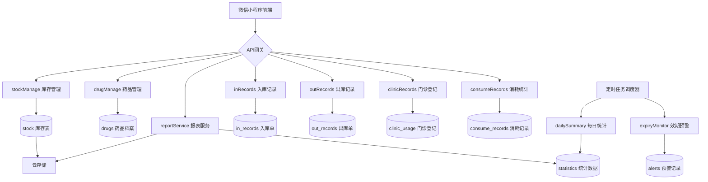
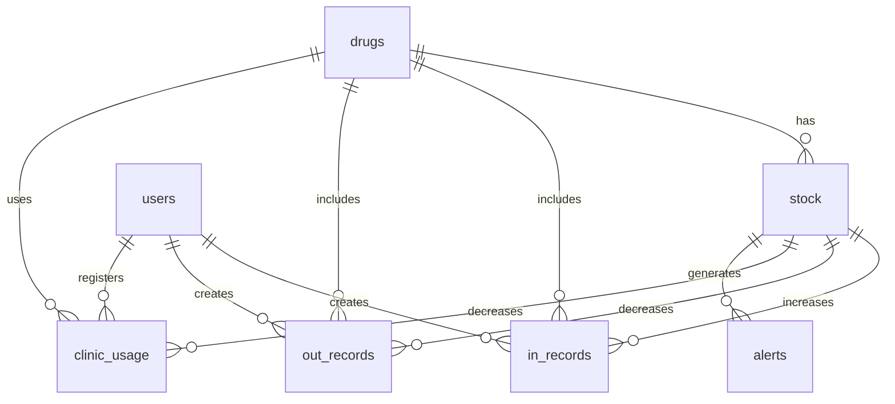

# ⚙️ AK-PMS 技术栈与实现说明 v3.3

<div align="center">

**文档版本**: v3.3  
**更新日期**: 2025-11-01  
**维护团队**: AK-PMS Dev Team  
**适用对象**: 开发人员、运维人员、技术架构师

</div>

---

## 📑 文档目录

- [1. 技术栈概览](#1-技术栈概览)
- [2. 系统架构](#2-系统架构)
- [3. 前端技术](#3-前端技术)
- [4. 后端技术](#4-后端技术)
- [5. 数据库设计](#5-数据库设计)
- [6. 云函数详解](#6-云函数详解)
- [7. 定时任务与触发器](#7-定时任务与触发器)
- [8. API接口规范](#8-api接口规范)
- [9. 安全与权限](#9-安全与权限)
- [10. 性能优化](#10-性能优化)
- [11. 部署指南](#11-部署指南)
- [12. 监控与运维](#12-监控与运维)

---

## 1. 技术栈概览

### 1.1 技术架构图

```
┌─────────────────────────────────────────────────────────┐
│                    用户层（微信小程序）                      │
├─────────────────────────────────────────────────────────┤
│  前端框架: uni-app + Vue3                                 │
│  UI组件: Vant Weapp + uView Plus                         │
│  图表库: ECharts (Apache v5.4+)                          │
│  状态管理: Vuex / Pinia                                  │
└────────────────┬────────────────────────────────────────┘
                 │ HTTPS / WebSocket
┌────────────────▼────────────────────────────────────────┐
│              应用层（腾讯云开发）                          │
├─────────────────────────────────────────────────────────┤
│  云函数: Node.js 18                                       │
│  运行环境: Tencent CloudBase                              │
│  API网关: 自动生成RESTful接口                             │
└────────────────┬────────────────────────────────────────┘
                 │
┌────────────────▼────────────────────────────────────────┐
│              数据层（云数据库）                            │
├─────────────────────────────────────────────────────────┤
│  数据库类型: MongoDB (文档型)                             │
│  存储服务: 云存储（签名/图片/导出文件）                     │
│  日志系统: 云日志 + operation_logs集合                     │
└─────────────────────────────────────────────────────────┘
```

### 1.2 技术栈清单

| 分类 | 技术/工具 | 版本 | 用途 |
|------|----------|------|------|
| **前端框架** | uni-app | 3.x | 跨平台开发框架 |
| **JS框架** | Vue.js | 3.x | 响应式UI开发 |
| **UI组件库** | Vant Weapp | 1.11+ | 移动端UI组件 |
| | uView Plus | 3.x | uni-app UI库 |
| **图表库** | ECharts | 5.4+ | 数据可视化 |
| **状态管理** | Vuex / Pinia | 4.x / 2.x | 全局状态管理 |
| **CSS预处理** | Sass/SCSS | - | 样式开发 |
| **后端运行时** | Node.js | 18 LTS | 云函数运行环境 |
| **云平台** | 腾讯云开发 | CloudBase | Serverless服务 |
| **数据库** | MongoDB | 4.4+ | 文档型数据库 |
| **云存储** | COS | - | 对象存储服务 |
| **定时任务** | 云函数触发器 | - | 定时执行 |
| **日志服务** | 云日志 | - | 日志收集与分析 |

### 1.3 开发环境

```yaml
development:
  env_id: akpms-dev-xxxxx
  node_version: 18.17.0
  npm_version: 9.6.7
  ide: HBuilderX / WeChat DevTools
  
production:
  env_id: akpms-prod-xxxxx
  node_version: 18.17.0
  database: MongoDB 4.4
  region: ap-shanghai
```

---

## 2. 系统架构

### 2.1 整体架构设计



### 2.2 分层架构

| 层级 | 职责 | 技术实现 |
|------|------|---------|
| **表现层** | 用户交互、数据展示 | uni-app + Vue3 + Vant |
| **业务层** | 业务逻辑、数据处理 | 云函数 (Node.js) |
| **数据层** | 数据持久化、查询 | MongoDB + 云存储 |
| **服务层** | 定时任务、消息推送 | 云函数触发器 |

### 2.3 核心设计模式

#### **分园区管理模式**
```javascript
// location 字段贯穿全系统
const LOCATIONS = {
  LAND_PARK: 'land_park',         // 陆园
  WATER_PARK: 'water_park',       // 水园
  CLINIC_STORAGE: 'clinic_storage' // 医务室仓库
};

// 所有库存操作必须指定 location
stock = { drugId, batch, location }  // 唯一键
```

#### **FIFO批次管理**
```javascript
// 批次按有效期自动排序
const batches = await db.collection('stock')
  .where({
    drugId: drugId,
    location: location,
    quantity: _.gt(0)
  })
  .orderBy('expiryDate', 'asc')  // FIFO: 先进先出
  .get();
```

---

## 3. 前端技术

### 3.1 项目结构

```
/uniapp-project
├── pages/                    # 主包页面
│   ├── index/               # 首页
│   ├── stock/               # 库存管理
│   ├── record/              # 单据管理
│   └── stats/               # 统计报表
├── pages-sub/               # 分包页面
│   ├── in/                  # 入库模块
│   ├── out/                 # 出库模块
│   ├── clinic/              # 门诊登记
│   ├── consume/             # 消耗统计
│   └── report/              # 报表查询
├── components/              # 公共组件
│   ├── Scanner/             # 扫码组件
│   ├── DrugSelector/        # 药品选择器
│   ├── BatchSelector/       # 批次选择器
│   ├── Signature/           # 电子签名
│   └── Chart/               # 图表组件
├── store/                   # 状态管理
│   ├── modules/
│   │   ├── user.js          # 用户状态
│   │   ├── drug.js          # 药品缓存
│   │   └── stock.js         # 库存缓存
│   └── index.js
├── utils/                   # 工具函数
│   ├── request.js           # 请求封装
│   ├── auth.js              # 权限验证
│   ├── formatter.js         # 数据格式化
│   └── validator.js         # 表单验证
├── static/                  # 静态资源
├── App.vue                  # 应用入口
├── main.js                  # 入口文件
├── manifest.json            # 应用配置
└── pages.json               # 路由配置
```

### 3.2 核心组件设计

#### **Scanner 扫码组件**
```vue
<template>
  <view class="scanner">
    <button @click="scanCode">扫描条形码</button>
  </view>
</template>

<script>
export default {
  methods: {
    async scanCode() {
      try {
        const res = await uni.scanCode({
          scanType: ['barCode']
        });
        
        // 调用云函数查询药品信息
        const drug = await this.getDrugByBarcode(res.result);
        this.$emit('scan-success', drug);
      } catch (err) {
        uni.showToast({
          title: '扫码失败',
          icon: 'none'
        });
      }
    },
    
    async getDrugByBarcode(barcode) {
      const res = await wx.cloud.callFunction({
        name: 'drugManage',
        data: {
          action: 'getByBarcode',
          data: { barcode }
        }
      });
      return res.result.data;
    }
  }
}
</script>
```

#### **Chart 图表组件**
```vue
<template>
  <view class="chart-container">
    <canvas 
      canvas-id="chart" 
      id="chart"
      class="ec-canvas"
      @touchstart="touchStart"
      @touchmove="touchMove"
      @touchend="touchEnd"
    ></canvas>
  </view>
</template>

<script>
import * as echarts from 'echarts';

export default {
  props: {
    chartData: Object,
    chartType: String  // 'line' | 'bar' | 'pie'
  },
  
  mounted() {
    this.initChart();
  },
  
  methods: {
    initChart() {
      const chart = echarts.init(document.getElementById('chart'));
      
      let option = {};
      switch(this.chartType) {
        case 'line':
          option = this.getLineOption();
          break;
        case 'bar':
          option = this.getBarOption();
          break;
        case 'pie':
          option = this.getPieOption();
          break;
      }
      
      chart.setOption(option);
    },
    
    getLineOption() {
      return {
        xAxis: {
          type: 'category',
          data: this.chartData.dates
        },
        yAxis: {
          type: 'value'
        },
        series: [{
          data: this.chartData.values,
          type: 'line',
          smooth: true
        }]
      };
    }
  }
}
</script>
```

### 3.3 状态管理

```javascript
// store/modules/stock.js
export default {
  namespaced: true,
  
  state: {
    currentLocation: 'land_park',
    stockList: [],
    lowStockCount: 0,
    expiryWarningCount: 0
  },
  
  mutations: {
    SET_LOCATION(state, location) {
      state.currentLocation = location;
    },
    
    SET_STOCK_LIST(state, list) {
      state.stockList = list;
    },
    
    UPDATE_WARNING_COUNT(state, { lowStock, expiry }) {
      state.lowStockCount = lowStock;
      state.expiryWarningCount = expiry;
    }
  },
  
  actions: {
    async fetchStockList({ commit, state }) {
      const res = await wx.cloud.callFunction({
        name: 'stockManage',
        data: {
          action: 'getList',
          data: {
            location: state.currentLocation
          }
        }
      });
      
      commit('SET_STOCK_LIST', res.result.data);
    }
  }
}
```

---

## 4. 后端技术

### 4.1 云函数目录结构

```
/cloudfunctions
├── drugManage/              # 药品档案管理
│   ├── index.js
│   ├── package.json
│   └── config.json
├── stockManage/             # 库存管理
├── inRecords/               # 入库记录
├── outRecords/              # 出库记录
├── clinicRecords/           # 门诊登记
├── consumeRecords/          # 消耗统计
├── requisitionRecords/      # 请领管理
├── reportService/           # 报表服务
├── queryService/            # 查询服务
├── dailySummary/            # 每日统计（定时）
├── expiryMonitor/           # 效期预警（定时）
└── common/                  # 公共模块
    ├── db.js                # 数据库操作
    ├── auth.js              # 权限验证
    └── utils.js             # 工具函数
```

### 4.2 云函数开发规范

#### **标准模板**
```javascript
// cloudfunctions/drugManage/index.js
const cloud = require('wx-server-sdk');
cloud.init({
  env: cloud.DYNAMIC_CURRENT_ENV
});

const db = cloud.database();
const _ = db.command;

exports.main = async (event, context) => {
  const { action, data } = event;
  const { OPENID } = cloud.getWXContext();
  
  try {
    // 权限验证
    await checkPermission(OPENID, action);
    
    // 路由分发
    switch(action) {
      case 'getList':
        return await getList(data);
      case 'add':
        return await addDrug(data, OPENID);
      case 'update':
        return await updateDrug(data, OPENID);
      case 'delete':
        return await deleteDrug(data, OPENID);
      default:
        return { success: false, error: 'Unknown action' };
    }
  } catch (err) {
    console.error('[drugManage Error]', err);
    return {
      success: false,
      error: err.message || '服务器错误'
    };
  }
};

// 权限验证
async function checkPermission(openid, action) {
  const user = await db.collection('users')
    .where({ _openid: openid })
    .get();
    
  if (!user.data.length) {
    throw new Error('用户不存在');
  }
  
  const role = user.data[0].role;
  const permissions = ROLE_PERMISSIONS[role];
  
  if (!permissions.includes(action)) {
    throw new Error('权限不足');
  }
}

// 获取药品列表
async function getList(data) {
  const { keyword, page = 1, pageSize = 20 } = data;
  
  let query = db.collection('drugs');
  
  if (keyword) {
    query = query.where({
      name: db.RegExp({
        regexp: keyword,
        options: 'i'
      })
    });
  }
  
  const total = await query.count();
  const list = await query
    .skip((page - 1) * pageSize)
    .limit(pageSize)
    .orderBy('createTime', 'desc')
    .get();
    
  return {
    success: true,
    data: {
      list: list.data,
      total: total.total,
      page,
      pageSize
    }
  };
}
```

### 4.3 错误处理机制

```javascript
// common/errorHandler.js
class AppError extends Error {
  constructor(message, code = 500, data = null) {
    super(message);
    this.code = code;
    this.data = data;
  }
}

// 错误码定义
const ERROR_CODES = {
  PERMISSION_DENIED: 403,
  NOT_FOUND: 404,
  VALIDATION_ERROR: 400,
  DUPLICATE_KEY: 409,
  INSUFFICIENT_STOCK: 422
};

// 统一错误处理
function handleError(err) {
  if (err instanceof AppError) {
    return {
      success: false,
      code: err.code,
      error: err.message,
      data: err.data
    };
  }
  
  // 记录未知错误
  console.error('[Unhandled Error]', err);
  
  return {
    success: false,
    code: 500,
    error: '服务器内部错误'
  };
}

module.exports = {
  AppError,
  ERROR_CODES,
  handleError
};
```

---

## 5. 数据库设计

### 5.1 数据表结构

#### **drugs (药品档案表)**
```javascript
{
  _id: 'DR001',                    // 主键
  name: '阿莫西林胶囊',              // 药品名称
  specification: '0.25g×24粒',     // 规格 🔥
  unit: '盒',                      // 单位
  packUnit: '盒',                  // 包装单位
  minUnit: '粒',                   // 最小单位
  conversionRate: 24,              // 换算因子
  manufacturer: 'XX制药',          // 生产厂家
  barcode: '6901234567890',        // 条形码
  category: '抗生素',              // 分类
  isHighValue: false,              // 高值药品
  isEmergency: false,              // 急救药品
  price: 15.5,                     // 单价
  pinyin: 'AMXLJN',                // 拼音首字母
  pinyinFull: 'amoxilinjiaonang',  // 拼音全拼
  createTime: ISODate(),           // 创建时间
  updateTime: ISODate()            // 更新时间
}

// 索引
db.drugs.createIndex({ name: 1 });
db.drugs.createIndex({ barcode: 1 }, { unique: true });
db.drugs.createIndex({ pinyin: 1 });
```

#### **stock (库存表) 🔥 核心表**
```javascript
{
  _id: 'STK001',
  drugId: 'DR001',                 // 药品ID
  drugName: '阿莫西林胶囊',
  specification: '0.25g×24粒',     // 规格 🔥
  batch: 'BATCH20251101',          // 批次号
  location: 'land_park',           // 园区 🔥
  quantity: 32,                    // 当前库存（包装单位）
  unit: '盒',
  productionDate: ISODate(),       // 生产日期
  expiryDate: ISODate(),           // 有效期 🔥
  daysToExpiry: 76,                // 距有效期天数 🔥
  expiryStatus: '正常',            // 状态：正常/临期/过期 🔥
  price: 15.5,                     // 单价
  updateTime: ISODate()
}

// 复合唯一索引
db.stock.createIndex(
  { drugId: 1, batch: 1, location: 1 },
  { unique: true }
);

// 查询索引
db.stock.createIndex({ location: 1, drugId: 1 });
db.stock.createIndex({ expiryDate: 1 });
db.stock.createIndex({ daysToExpiry: 1 });
```

#### **clinic_usage (门诊登记表) 🔥 v3.2新增**
```javascript
{
  _id: 'CU20251101001',
  drugId: 'DR001',
  drugName: '阿莫西林胶囊',
  specification: '0.25g×24粒',     // 规格 🔥
  batchId: 'BATCH20251101',
  location: 'land_park',           // 园区 🔥 必填
  quantityMin: 6,                  // 最小单位数量（粒）
  quantityPack: 0.25,              // 包装单位数量（盒）
  unit: '粒',
  packUnit: '盒',
  operatorId: 'openid_doctor',
  operatorName: '李医生',
  patient: '张三',                 // 患者姓名
  symptom: '感冒发烧',             // 症状（可选）
  createTime: ISODate()
}

// 索引
db.clinic_usage.createIndex(
  { location: 1, drugId: 1, createTime: -1 }
);
db.clinic_usage.createIndex({ patient: 1 });
db.clinic_usage.createIndex({ operatorId: 1, createTime: -1 });
```

#### **statistics (统计数据表) 🔥 v3.3新增**
```javascript
{
  _id: 'STAT20251101_land_park',
  date: '2025-11-01',              // 统计日期
  location: 'land_park',           // 园区
  type: 'daily',                   // 类型：daily/monthly
  
  // 入库统计
  inbound: {
    count: 5,                      // 入库单数量
    totalQuantity: 100,            // 总入库量
    totalAmount: 1550              // 总金额
  },
  
  // 出库统计
  outbound: {
    count: 3,
    totalQuantity: 30,
    totalAmount: 465
  },
  
  // 门诊统计
  clinic: {
    count: 12,                     // 门诊登记次数
    totalQuantity: 40,
    patientCount: 8                // 患者人数
  },
  
  // 库存统计
  stock: {
    totalValue: 50000,             // 库存总值
    drugCount: 150,                // 药品种类
    lowStockCount: 5,              // 低库存药品数
    expiryWarningCount: 3          // 临期预警数
  },
  
  createTime: ISODate()
}

// 索引
db.statistics.createIndex({ date: -1, location: 1 });
db.statistics.createIndex({ type: 1, location: 1 });
```

### 5.2 数据关系图



---

## 6. 云函数详解

### 6.1 reportService (报表服务) 🔥 新增

```javascript
// cloudfunctions/reportService/index.js
const cloud = require('wx-server-sdk');
cloud.init({ env: cloud.DYNAMIC_CURRENT_ENV });
const db = cloud.database();
const _ = db.command;

exports.main = async (event, context) => {
  const { reportType, params } = event;
  
  switch(reportType) {
    case 'R1_inbound':
      return await getInboundReport(params);
    case 'R2_outbound':
      return await getOutboundReport(params);
    case 'R3_clinic':
      return await getClinicReport(params);
    case 'R4_stock':
      return await getStockReport(params);
    case 'R5_check':
      return await getCheckReport(params);
    default:
      return { success: false, error: 'Unknown report type' };
  }
};

// R4: 库存结存与有效期预警报表
async function getStockReport(params) {
  const { location, startDate, endDate } = params;
  
  let query = db.collection('stock');
  
  // 园区筛选
  if (location && location !== 'all') {
    query = query.where({ location });
  }
  
  // 有效期筛选
  if (startDate && endDate) {
    query = query.where({
      expiryDate: _.gte(new Date(startDate)).and(_.lte(new Date(endDate)))
    });
  }
  
  const stocks = await query.get();
  
  // 计算距有效期天数和状态
  const today = new Date();
  const reportData = stocks.data.map(stock => {
    const daysToExpiry = Math.ceil(
      (new Date(stock.expiryDate) - today) / (1000 * 60 * 60 * 24)
    );
    
    let expiryStatus = '正常';
    if (daysToExpiry <= 0) expiryStatus = '过期';
    else if (daysToExpiry <= 60) expiryStatus = '临期';
    
    return {
      ...stock,
      daysToExpiry,
      expiryStatus,
      statusColor: expiryStatus === '过期' ? 'red' : 
                   expiryStatus === '临期' ? 'orange' : 'green'
    };
  });
  
  // 按状态分组统计
  const summary = {
    total: reportData.length,
    expired: reportData.filter(s => s.expiryStatus === '过期').length,
    expiring: reportData.filter(s => s.expiryStatus === '临期').length,
    normal: reportData.filter(s => s.expiryStatus === '正常').length
  };
  
  return {
    success: true,
    data: {
      list: reportData,
      summary
    }
  };
}

// R3: 门诊用药统计报表（分园区）
async function getClinicReport(params) {
  const { location, startDate, endDate, groupBy = 'day' } = params;
  
  // 聚合查询
  const result = await db.collection('clinic_usage')
    .aggregate()
    .match({
      location,
      createTime: _.gte(new Date(startDate)).and(_.lte(new Date(endDate)))
    })
    .group({
      _id: {
        date: groupBy === 'day' ? '$createTime' : '$drugId',
        drugId: '$drugId',
        drugName: '$drugName',
        specification: '$specification'
      },
      totalQuantity: _.sum('$quantityMin'),
      count: _.sum(1)
    })
    .sort({ '_id.date': 1 })
    .end();
    
  // 格式化数据供图表使用
  const chartData = {
    dates: [],
    series: {}
  };
  
  result.list.forEach(item => {
    const date = formatDate(item._id.date);
    if (!chartData.dates.includes(date)) {
      chartData.dates.push(date);
    }
    
    const drugName = item._id.drugName;
    if (!chartData.series[drugName]) {
      chartData.series[drugName] = [];
    }
    chartData.series[drugName].push(item.totalQuantity);
  });
  
  return {
    success: true,
    data: {
      list: result.list,
      chartData
    }
  };
}
```

### 6.2 queryService (查询服务) 🔥 新增

```javascript
// cloudfunctions/queryService/index.js
exports.main = async (event, context) => {
  const { queryType, params } = event;
  
  switch(queryType) {
    case 'Q1_drug':
      return await queryDrug(params);
    case 'Q2_stock':
      return await queryStock(params);
    case 'Q3_clinic':
      return await queryClinic(params);
    case 'Q4_inbound':
      return await queryInbound(params);
    case 'Q5_outbound':
      return await queryOutbound(params);
    case 'Q6_check':
      return await queryCheck(params);
    default:
      return { success: false, error: 'Unknown query type' };
  }
};

// Q2: 实时库存查询
async function queryStock(params) {
  const { drugName, location, batch, expiryWarning = false } = params;
  
  let whereCondition = {};
  
  // 模糊查询药品名称
  if (drugName) {
    whereCondition.drugName = db.RegExp({
      regexp: drugName,
      options: 'i'
    });
  }
  
  // 园区筛选
  if (location && location !== 'all') {
    whereCondition.location = location;
  }
  
  // 批次筛选
  if (batch) {
    whereCondition.batch = batch;
  }
  
  // 有效期预警筛选
  if (expiryWarning) {
    whereCondition.daysToExpiry = _.lte(60);
  }
  
  const result = await db.collection('stock')
    .where(whereCondition)
    .orderBy('expiryDate', 'asc')
    .get();
    
  return {
    success: true,
    data: result.data
  };
}
```

---

## 7. 定时任务与触发器

### 7.1 dailySummary (每日统计)

```javascript
// cloudfunctions/dailySummary/index.js
// 触发器配置: 每日 23:59 执行 (cron: 59 23 * * *)

const cloud = require('wx-server-sdk');
cloud.init({ env: cloud.DYNAMIC_CURRENT_ENV });
const db = cloud.database();
const _ = db.command;

exports.main = async (event, context) => {
  const today = formatDate(new Date());
  const locations = ['land_park', 'water_park', 'clinic_storage'];
  
  console.log(`[dailySummary] Starting for date: ${today}`);
  
  try {
    for (const location of locations) {
      await generateDailySummary(today, location);
    }
    
    return { success: true, message: 'Daily summary completed' };
  } catch (err) {
    console.error('[dailySummary Error]', err);
    return { success: false, error: err.message };
  }
};

async function generateDailySummary(date, location) {
  const startOfDay = new Date(date + ' 00:00:00');
  const endOfDay = new Date(date + ' 23:59:59');
  
  // 1. 入库统计
  const inboundStats = await db.collection('in_records')
    .aggregate()
    .match({
      location,
      createTime: _.gte(startOfDay).and(_.lte(endOfDay)),
      status: 'approved'
    })
    .group({
      _id: null,
      count: _.sum(1),
      totalQuantity: _.sum('$quantity'),
      totalAmount: _.sum('$totalAmount')
    })
    .end();
    
  // 2. 出库统计
  const outboundStats = await db.collection('out_records')
    .aggregate()
    .match({
      location,
      createTime: _.gte(startOfDay).and(_.lte(endOfDay)),
      status: 'approved'
    })
    .group({
      _id: null,
      count: _.sum(1),
      totalQuantity: _.sum('$quantity')
    })
    .end();
    
  // 3. 门诊统计
  const clinicStats = await db.collection('clinic_usage')
    .aggregate()
    .match({
      location,
      createTime: _.gte(startOfDay).and(_.lte(endOfDay))
    })
    .group({
      _id: null,
      count: _.sum(1),
      totalQuantity: _.sum('$quantityMin'),
      patientCount: _.addToSet('$patient')
    })
    .end();
    
  // 4. 库存统计
  const stockStats = await db.collection('stock')
    .aggregate()
    .match({ location })
    .group({
      _id: null,
      totalValue: _.sum(_.multiply(['$quantity', '$price'])),
      drugCount: _.sum(1),
      lowStockCount: _.sum(_.cond([
        _.lte(['$quantity', '$minStock']), 1, 0
      ])),
      expiryWarningCount: _.sum(_.cond([
        _.lte(['$daysToExpiry', 60]), 1, 0
      ]))
    })
    .end();
    
  // 5. 写入统计表
  await db.collection('statistics').add({
    data: {
      _id: `STAT${date.replace(/-/g, '')}_${location}`,
      date,
      location,
      type: 'daily',
      inbound: inboundStats.list[0] || {},
      outbound: outboundStats.list[0] || {},
      clinic: {
        ...clinicStats.list[0],
        patientCount: clinicStats.list[0]?.patientCount?.length || 0
      },
      stock: stockStats.list[0] || {},
      createTime: new Date()
    }
  });
  
  console.log(`[dailySummary] Completed for ${location} on ${date}`);
}

function formatDate(date) {
  const d = new Date(date);
  const year = d.getFullYear();
  const month = String(d.getMonth() + 1).padStart(2, '0');
  const day = String(d.getDate()).padStart(2, '0');
  return `${year}-${month}-${day}`;
}
```

### 7.2 expiryMonitor (效期预警)

```javascript
// cloudfunctions/expiryMonitor/index.js
// 触发器配置: 每日 00:10 执行 (cron: 10 0 * * *)

const cloud = require('wx-server-sdk');
cloud.init({ env: cloud.DYNAMIC_CURRENT_ENV });
const db = cloud.database();
const _ = db.command;

exports.main = async (event, context) => {
  console.log('[expiryMonitor] Starting expiry check');
  
  try {
    const today = new Date();
    const stocks = await db.collection('stock').get();
    
    let expiredCount = 0;
    let expiringCount = 0;
    const alerts = [];
    
    for (const stock of stocks.data) {
      // 计算距有效期天数
      const daysToExpiry = Math.ceil(
        (new Date(stock.expiryDate) - today) / (1000 * 60 * 60 * 24)
      );
      
      let status = '正常';
      if (daysToExpiry <= 0) {
        status = '过期';
        expiredCount++;
      } else if (daysToExpiry <= 60) {
        status = '临期';
        expiringCount++;
      }
      
      // 更新库存表中的状态
      await db.collection('stock').doc(stock._id).update({
        data: {
          daysToExpiry,
          expiryStatus: status,
          updateTime: today
        }
      });
      
      // 生成预警记录
      if (status !== '正常') {
        const alert = {
          type: 'expiry',
          level: status === '过期' ? 'critical' : 'warning',
          drugId: stock.drugId,
          drugName: stock.drugName,
          specification: stock.specification,
          batch: stock.batch,
          location: stock.location,
          quantity: stock.quantity,
          unit: stock.unit,
          expiryDate: stock.expiryDate,
          daysToExpiry,
          status,
          message: `【${status}预警】${stock.drugName} (${stock.specification}) 批次${stock.batch}，距有效期 ${daysToExpiry} 天`,
          createTime: today
        };
        
        alerts.push(alert);
        
        // 推送微信订阅消息
        await sendSubscribeMessage(alert);
      }
    }
    
    // 批量写入预警表
    if (alerts.length > 0) {
      await db.collection('alerts').add({ data: alerts });
    }
    
    console.log(`[expiryMonitor] Completed: ${expiredCount} expired, ${expiringCount} expiring`);
    
    return {
      success: true,
      data: {
        total: stocks.data.length,
        expiredCount,
        expiringCount,
        alertsCreated: alerts.length
      }
    };
  } catch (err) {
    console.error('[expiryMonitor Error]', err);
    return { success: false, error: err.message };
  }
};

// 发送订阅消息
async function sendSubscribeMessage(alert) {
  try {
    // 获取需要接收预警的用户
    const users = await db.collection('users')
      .where({
        role: _.in(['admin', 'pharmacist']),
        subscribeExpiry: true
      })
      .get();
      
    for (const user of users.data) {
      await cloud.openapi.subscribeMessage.send({
        touser: user._openid,
        page: 'pages/stock/index',
        data: {
          thing1: { value: alert.drugName },
          thing2: { value: alert.message },
          date3: { value: formatDate(alert.expiryDate) }
        },
        templateId: 'TEMPLATE_ID_FOR_EXPIRY_WARNING'
      });
    }
  } catch (err) {
    console.error('[sendSubscribeMessage Error]', err);
  }
}
```

---

## 8. API接口规范

### 8.1 请求格式

```javascript
// 标准请求格式
{
  "action": "getList",           // 操作类型
  "data": {                      // 请求参数
    "page": 1,
    "pageSize": 20,
    "keyword": "阿莫西林"
  }
}

// 标准响应格式
{
  "success": true,               // 成功标志
  "data": {                      // 响应数据
    "list": [],
    "total": 100,
    "page": 1,
    "pageSize": 20
  },
  "message": "操作成功"          // 消息（可选）
}

// 错误响应格式
{
  "success": false,
  "code": 400,
  "error": "参数错误",
  "details": {}                  // 详细信息（可选）
}
```

### 8.2 状态码定义

| 状态码 | 含义 | 说明 |
|-------|------|------|
| 200 | 成功 | 请求成功 |
| 400 | 参数错误 | 请求参数不正确 |
| 401 | 未授权 | 用户未登录 |
| 403 | 权限不足 | 无权执行此操作 |
| 404 | 未找到 | 资源不存在 |
| 409 | 冲突 | 数据冲突（如重复） |
| 422 | 业务错误 | 业务逻辑错误（如库存不足） |
| 500 | 服务器错误 | 内部错误 |

### 8.3 接口清单

| 云函数 | Action | 描述 | 参数 |
|--------|--------|------|------|
| **drugManage** | getList | 获取药品列表 | keyword, page, pageSize |
| | getByBarcode | 扫码获取药品 | barcode |
| | add | 添加药品 | drug对象 |
| | update | 更新药品 | _id, updates |
| | delete | 删除药品 | _id |
| **stockManage** | getList | 库存汇总 | location, keyword |
| | getBatchList | 批次库存 | drugId, location |
| | getLowStock | 低库存预警 | location |
| | getNearExpiry | 近效期预警 | location, days |
| **reportService** | R1_inbound | 入库明细报表 | startDate, endDate, location |
| | R2_outbound | 出库汇总报表 | startDate, endDate, location |
| | R3_clinic | 门诊统计报表 | startDate, endDate, location |
| | R4_stock | 库存预警报表 | location, expiryWarning |
| | R5_check | 盘点差异报表 | month, location |
| **queryService** | Q1_drug | 药品综合查询 | name, specification, batch |
| | Q2_stock | 实时库存查询 | drugName, location, batch |
| | Q3_clinic | 门诊用药查询 | startDate, endDate, location |
| | Q4_inbound | 入库记录查询 | startDate, endDate, manufacturer |
| | Q5_outbound | 出库记录查询 | startDate, endDate, department |
| | Q6_check | 盘点历史查询 | month, location, drugName |

---

## 9. 安全与权限

### 9.1 角色权限设计

```javascript
// 角色定义
const ROLES = {
  ADMIN: 'admin',              // 系统管理员
  PHARMACIST: 'pharmacist',    // 药剂师
  DOCTOR: 'doctor',            // 门诊医生
  CLERK: 'clerk'               // 仓库管理员
};

// 权限矩阵
const ROLE_PERMISSIONS = {
  admin: [
    'drug.*',
    'stock.*',
    'inbound.*',
    'outbound.*',
    'clinic.*',
    'report.*',
    'query.*',
    'user.manage'
  ],
  
  pharmacist: [
    'drug.view',
    'drug.add',
    'drug.update',
    'stock.view',
    'inbound.*',
    'outbound.approve',
    'report.*'
  ],
  
  doctor: [
    'drug.view',
    'stock.view',
    'clinic.*',
    'query.clinic'
  ],
  
  clerk: [
    'stock.view',
    'outbound.create',
    'query.stock',
    'query.outbound'
  ]
};

// 权限验证函数
function hasPermission(userRole, action) {
  const permissions = ROLE_PERMISSIONS[userRole] || [];
  
  return permissions.some(permission => {
    // 完全匹配
    if (permission === action) return true;
    
    // 通配符匹配
    if (permission.endsWith('.*')) {
      const prefix = permission.slice(0, -2);
      return action.startsWith(prefix);
    }
    
    return false;
  });
}
```

### 9.2 数据权限

```javascript
// 按园区隔离数据
async function getDataByLocation(collection, userLocation, query = {}) {
  // 管理员可以查看所有园区
  if (userRole === 'admin') {
    return await db.collection(collection).where(query).get();
  }
  
  // 其他角色只能查看自己园区的数据
  query.location = userLocation;
  return await db.collection(collection).where(query).get();
}

// 操作日志记录
async function logOperation(action, data, user) {
  await db.collection('operation_logs').add({
    data: {
      action,
      data,
      userId: user._openid,
      userName: user.name,
      role: user.role,
      ip: user.ip,
      createTime: new Date()
    }
  });
}
```

### 9.3 敏感信息保护

```javascript
// 脱敏处理
function maskSensitiveData(data, fields = ['phone', 'idCard']) {
  const masked = { ...data };
  
  fields.forEach(field => {
    if (masked[field]) {
      masked[field] = maskString(masked[field]);
    }
  });
  
  return masked;
}

function maskString(str) {
  if (str.length <= 4) return '****';
  return str.slice(0, 2) + '****' + str.slice(-2);
}
```

---

## 10. 性能优化

### 10.1 数据库优化

#### **索引策略**
```javascript
// 1. 单字段索引
db.drugs.createIndex({ name: 1 });
db.drugs.createIndex({ barcode: 1 }, { unique: true });

// 2. 复合索引
db.stock.createIndex({ drugId: 1, batch: 1, location: 1 }, { unique: true });
db.clinic_usage.createIndex({ location: 1, drugId: 1, createTime: -1 });

// 3. 文本索引（全文搜索）
db.drugs.createIndex({ name: "text", manufacturer: "text" });

// 4. TTL索引（自动删除过期数据）
db.operation_logs.createIndex(
  { createTime: 1 },
  { expireAfterSeconds: 7776000 }  // 90天后自动删除
);
```

#### **查询优化**
```javascript
// 使用投影减少数据传输
const drugs = await db.collection('drugs')
  .field({
    name: true,
    specification: true,
    unit: true,
    price: true
  })
  .get();

// 使用聚合管道
const summary = await db.collection('stock')
  .aggregate()
  .match({ location: 'land_park' })
  .group({
    _id: '$drugId',
    totalQuantity: _.sum('$quantity'),
    totalValue: _.sum(_.multiply(['$quantity', '$price']))
  })
  .end();

// 分页查询
const pageSize = 20;
const page = 1;
const list = await db.collection('drugs')
  .skip((page - 1) * pageSize)
  .limit(pageSize)
  .get();
```

### 10.2 缓存策略

```javascript
// store/modules/cache.js
export default {
  state: {
    drugCache: {},          // 药品缓存
    stockCache: {},         // 库存缓存
    cacheExpiry: {}         // 缓存过期时间
  },
  
  mutations: {
    SET_DRUG_CACHE(state, { drugId, data }) {
      state.drugCache[drugId] = data;
      state.cacheExpiry[`drug_${drugId}`] = Date.now() + 300000;  // 5分钟
    },
    
    CLEAR_EXPIRED_CACHE(state) {
      const now = Date.now();
      Object.keys(state.cacheExpiry).forEach(key => {
        if (state.cacheExpiry[key] < now) {
          const [type, id] = key.split('_');
          if (type === 'drug') {
            delete state.drugCache[id];
          } else if (type === 'stock') {
            delete state.stockCache[id];
          }
          delete state.cacheExpiry[key];
        }
      });
    }
  },
  
  actions: {
    async getDrug({ state, commit }, drugId) {
      // 检查缓存
      if (state.drugCache[drugId]) {
        const expiry = state.cacheExpiry[`drug_${drugId}`];
        if (expiry > Date.now()) {
          return state.drugCache[drugId];
        }
      }
      
      // 从服务器获取
      const res = await wx.cloud.callFunction({
        name: 'drugManage',
        data: {
          action: 'getDetail',
          data: { _id: drugId }
        }
      });
      
      // 更新缓存
      commit('SET_DRUG_CACHE', {
        drugId,
        data: res.result.data
      });
      
      return res.result.data;
    }
  }
}
```

### 10.3 图片优化

```javascript
// 压缩上传图片
async function uploadImage(filePath) {
  // 压缩图片
  const compressed = await uni.compressImage({
    src: filePath,
    quality: 80,
    width: 800
  });
  
  // 上传到云存储
  const result = await wx.cloud.uploadFile({
    cloudPath: `images/${Date.now()}.jpg`,
    filePath: compressed.tempFilePath
  });
  
  return result.fileID;
}

// 图片懒加载
<image 
  :src="imageUrl" 
  lazy-load
  mode="aspectFill"
  @load="onImageLoad"
  @error="onImageError"
/>
```

---

## 11. 部署指南

### 11.1 环境准备

```bash
# 1. 安装Node.js (推荐 18 LTS)
node -v  # v18.17.0

# 2. 安装微信开发者工具
# 下载地址: https://developers.weixin.qq.com/miniprogram/dev/devtools/download.html

# 3. 安装HBuilderX (可选)
# 下载地址: https://www.dcloud.io/hbuilderx.html

# 4. 安装云开发CLI
npm install -g @cloudbase/cli

# 5. 登录云开发
tcb login
```

### 11.2 部署步骤

#### **Step 1: 创建云环境**
```bash
# 创建云开发环境
tcb env:create akpms-prod --alias "AK-PMS生产环境"

# 查看环境列表
tcb env:list
```

#### **Step 2: 部署云函数**
```bash
# 进入云函数目录
cd cloudfunctions

# 批量部署所有云函数
for dir in */; do
  cd "$dir"
  npm install
  tcb fn:deploy --name "${dir%/}" --force
  cd ..
done

# 或逐个部署
cd drugManage
npm install
tcb fn:deploy --name drugManage --force
```

#### **Step 3: 初始化数据库**
```javascript
// scripts/initDatabase.js
const cloud = require('wx-server-sdk');
cloud.init({ env: 'akpms-prod-xxxxx' });
const db = cloud.database();

async function initDatabase() {
  // 1. 创建集合
  const collections = [
    'drugs', 'stock', 'in_records', 'out_records',
    'clinic_usage', 'consume_records', 'requisition_records',
    'statistics', 'alerts', 'users', 'operation_logs'
  ];
  
  for (const name of collections) {
    try {
      await db.createCollection(name);
      console.log(`✅ Created collection: ${name}`);
    } catch (err) {
      console.log(`⚠️  Collection ${name} already exists`);
    }
  }
  
  // 2. 创建索引
  await createIndexes();
  
  // 3. 插入初始数据
  await insertInitialData();
  
  console.log('🎉 Database initialization completed!');
}

async function createIndexes() {
  // drugs索引
  await db.collection('drugs').createIndex({ name: 1 });
  await db.collection('drugs').createIndex({ barcode: 1 }, { unique: true });
  await db.collection('drugs').createIndex({ pinyin: 1 });
  
  // stock索引
  await db.collection('stock').createIndex(
    { drugId: 1, batch: 1, location: 1 },
    { unique: true }
  );
  await db.collection('stock').createIndex({ location: 1, drugId: 1 });
  await db.collection('stock').createIndex({ expiryDate: 1 });
  
  // clinic_usage索引
  await db.collection('clinic_usage').createIndex({
    location: 1,
    drugId: 1,
    createTime: -1
  });
  
  // statistics索引
  await db.collection('statistics').createIndex({
    date: -1,
    location: 1
  });
  
  console.log('✅ Indexes created');
}

// 运行初始化
initDatabase().catch(console.error);
```

```bash
# 执行初始化脚本
node scripts/initDatabase.js
```

#### **Step 4: 配置定时任务**
```bash
# 在微信开发者工具中配置触发器
# 或使用CLI配置

# 每日统计任务 (每天23:59执行)
tcb fn:trigger:create dailySummary \
  --name daily-summary-trigger \
  --type timer \
  --config '{"cron":"59 23 * * *"}'

# 效期预警任务 (每天00:10执行)
tcb fn:trigger:create expiryMonitor \
  --name expiry-monitor-trigger \
  --type timer \
  --config '{"cron":"10 0 * * *"}'
```

#### **Step 5: 配置数据库权限**
```json
// database/permissions.json
{
  "drugs": {
    "read": "auth != null",
    "write": "auth != null && auth.role in ['admin', 'pharmacist']"
  },
  "stock": {
    "read": "auth != null",
    "write": "auth != null && auth.role in ['admin', 'pharmacist', 'clerk']"
  },
  "clinic_usage": {
    "read": "auth != null",
    "write": "auth != null && auth.role in ['admin', 'doctor']"
  },
  "operation_logs": {
    "read": "auth != null && auth.role == 'admin'",
    "write": false
  }
}
```

#### **Step 6: 部署小程序前端**
```bash
# 1. 安装依赖
npm install

# 2. 配置云环境ID
# 在 App.vue 中修改 env 参数
wx.cloud.init({
  env: 'akpms-prod-xxxxx',
  traceUser: true
});

# 3. 编译并上传
# 在微信开发者工具中点击"上传"按钮

# 4. 提交审核
# 在微信公众平台提交审核
```

### 11.3 环境变量配置

```javascript
// config/env.js
const ENV_CONFIG = {
  development: {
    envId: 'akpms-dev-xxxxx',
    logLevel: 'debug',
    enableMock: true
  },
  
  production: {
    envId: 'akpms-prod-xxxxx',
    logLevel: 'error',
    enableMock: false
  }
};

const env = process.env.NODE_ENV || 'development';
module.exports = ENV_CONFIG[env];
```

---

## 12. 监控与运维

### 12.1 日志监控

```javascript
// utils/logger.js
class Logger {
  static log(level, message, data = {}) {
    const logData = {
      level,
      message,
      data,
      timestamp: new Date().toISOString(),
      env: process.env.NODE_ENV
    };
    
    // 本地输出
    console.log(`[${level.toUpperCase()}]`, message, data);
    
    // 上报到云日志
    if (level === 'error' || level === 'warn') {
      wx.cloud.callFunction({
        name: 'logCollector',
        data: logData
      });
    }
  }
  
  static info(message, data) {
    this.log('info', message, data);
  }
  
  static warn(message, data) {
    this.log('warn', message, data);
  }
  
  static error(message, data) {
    this.log('error', message, data);
  }
}

export default Logger;
```

### 12.2 性能监控

```javascript
// utils/performance.js
class PerformanceMonitor {
  static trackAPICall(functionName, action, duration, success) {
    wx.cloud.callFunction({
      name: 'performanceCollector',
      data: {
        type: 'api',
        functionName,
        action,
        duration,
        success,
        timestamp: Date.now()
      }
    });
  }
  
  static trackPageLoad(pagePath, loadTime) {
    wx.cloud.callFunction({
      name: 'performanceCollector',
      data: {
        type: 'page',
        pagePath,
        loadTime,
        timestamp: Date.now()
      }
    });
  }
}

// 使用示例
const startTime = Date.now();
const res = await wx.cloud.callFunction({
  name: 'drugManage',
  data: { action: 'getList', data: params }
});
const duration = Date.now() - startTime;
PerformanceMonitor.trackAPICall('drugManage', 'getList', duration, res.result.success);
```

### 12.3 告警配置

```javascript
// cloudfunctions/alertManager/index.js
const ALERT_RULES = {
  // API错误率告警
  api_error_rate: {
    threshold: 0.05,  // 5%
    interval: 300000, // 5分钟
    notify: ['admin']
  },
  
  // 库存告警
  low_stock: {
    threshold: 5,     // 低于5件
    notify: ['admin', 'pharmacist']
  },
  
  // 效期告警
  expiry_warning: {
    threshold: 60,    // 60天内到期
    notify: ['admin', 'pharmacist']
  },
  
  // 数据库性能告警
  db_slow_query: {
    threshold: 3000,  // 3秒
    notify: ['admin']
  }
};

async function checkAndAlert(rule, currentValue) {
  if (currentValue > rule.threshold) {
    // 发送告警
    await sendAlert(rule.notify, {
      type: 'threshold_exceeded',
      rule: rule,
      currentValue
    });
  }
}
```

### 12.4 备份策略

```bash
# 数据库备份脚本
#!/bin/bash

DATE=$(date +%Y%m%d)
BACKUP_DIR="./backups/$DATE"

mkdir -p $BACKUP_DIR

# 导出所有集合
collections=("drugs" "stock" "in_records" "out_records" "clinic_usage" "statistics")

for collection in "${collections[@]}"; do
  echo "Backing up $collection..."
  tcb db:export \
    --env akpms-prod-xxxxx \
    --collection $collection \
    --file-path "$BACKUP_DIR/$collection.json"
done

# 压缩备份文件
tar -czf "$BACKUP_DIR.tar.gz" "$BACKUP_DIR"

# 上传到云存储
tcb storage:upload \
  --env akpms-prod-xxxxx \
  --local-path "$BACKUP_DIR.tar.gz" \
  --cloud-path "backups/$DATE.tar.gz"

echo "✅ Backup completed: $DATE.tar.gz"
```

### 12.5 故障排查清单

| 问题类型 | 排查步骤 | 解决方案 |
|---------|---------|---------|
| **云函数超时** | 1. 查看云函数日志<br>2. 检查数据库查询性能<br>3. 检查是否有死循环 | 1. 优化数据库查询<br>2. 增加索引<br>3. 增加云函数超时时间 |
| **数据库连接失败** | 1. 检查网络连接<br>2. 检查环境ID配置<br>3. 查看云开发控制台 | 1. 重新初始化云开发<br>2. 检查权限配置 |
| **库存扣减异常** | 1. 查看operation_logs<br>2. 检查库存流水<br>3. 验证并发控制 | 1. 使用事务处理<br>2. 添加分布式锁 |
| **报表数据不准确** | 1. 检查统计任务执行日志<br>2. 手动验证计算逻辑<br>3. 对比原始数据 | 1. 重新执行统计任务<br>2. 修复计算逻辑 |
| **小程序页面白屏** | 1. 查看控制台错误<br>2. 检查云函数返回数据<br>3. 检查组件渲染逻辑 | 1. 添加错误边界<br>2. 增加数据验证<br>3. 优化渲染性能 |

---

## 📚 附录

### A. 开发规范

#### **代码规范**
- 使用 ESLint + Prettier 进行代码格式化
- 变量命名采用 camelCase
- 常量命名采用 UPPER_SNAKE_CASE
- 文件命名采用 kebab-case

#### **Git提交规范**
```
feat: 新功能
fix: 修复bug
docs: 文档更新
style: 代码格式调整
refactor: 代码重构
test: 测试相关
chore: 构建/工具链相关
```

#### **注释规范**
```javascript
/**
 * 获取药品库存信息
 * @param {string} drugId - 药品ID
 * @param {string} location - 园区标识
 * @returns {Promise<Object>} 库存信息
 * @throws {AppError} 当药品不存在时抛出错误
 */
async function getStockInfo(drugId, location) {
  // 实现代码
}
```

### B. 常用命令

```bash
# 开发调试
npm run dev

# 生产构建
npm run build

# 云函数部署
npm run deploy:functions

# 数据库备份
npm run backup

# 运行测试
npm run test

# 代码检查
npm run lint

# 查看云函数日志
tcb fn:log --name drugManage --limit 100
```

### C. 技术支持

- **技术文档**: https://developers.weixin.qq.com/miniprogram/dev/
- **云开发文档**: https://developers.weixin.qq.com/miniprogram/dev/wxcloud/basis/getting-started.html
- **uni-app文档**: https://uniapp.dcloud.io/
- **项目仓库**: [GitHub Repository]
- **技术支持邮箱**: ak-pms-tech@example.com

---

<div align="center">

**⚙️ AK-PMS 技术栈与实现说明 v3.3**  
**最后更新**: 2025-11-01  
**维护团队**: AK-PMS Dev Team

**🔧 持续更新中，欢迎反馈建议**

</div>


